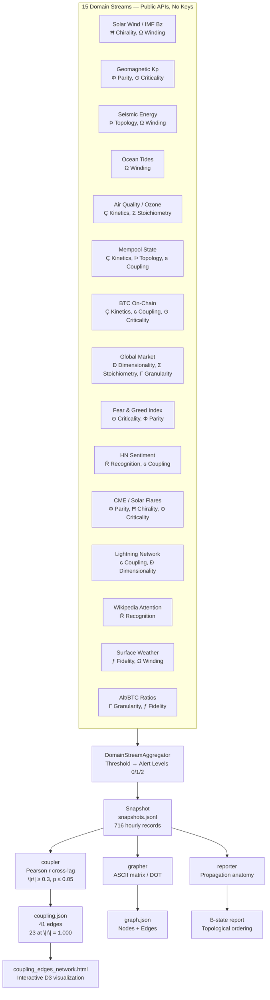
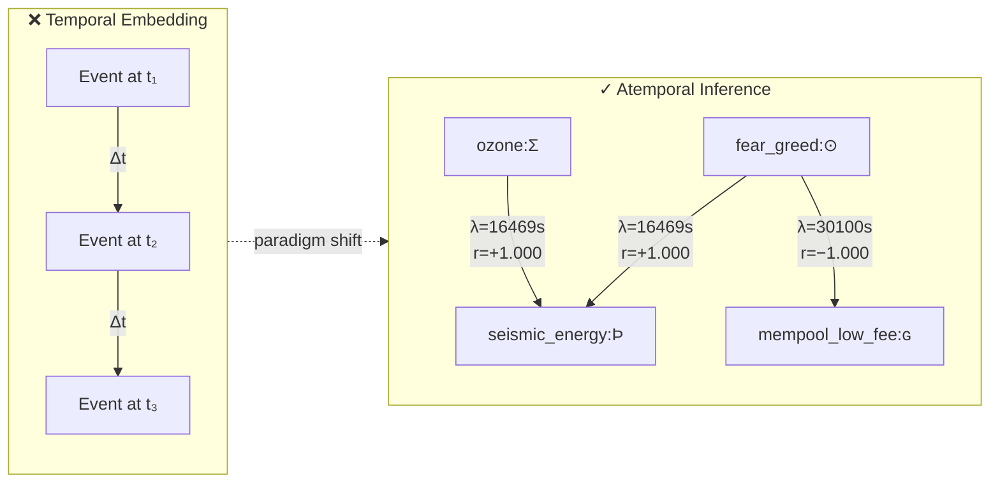
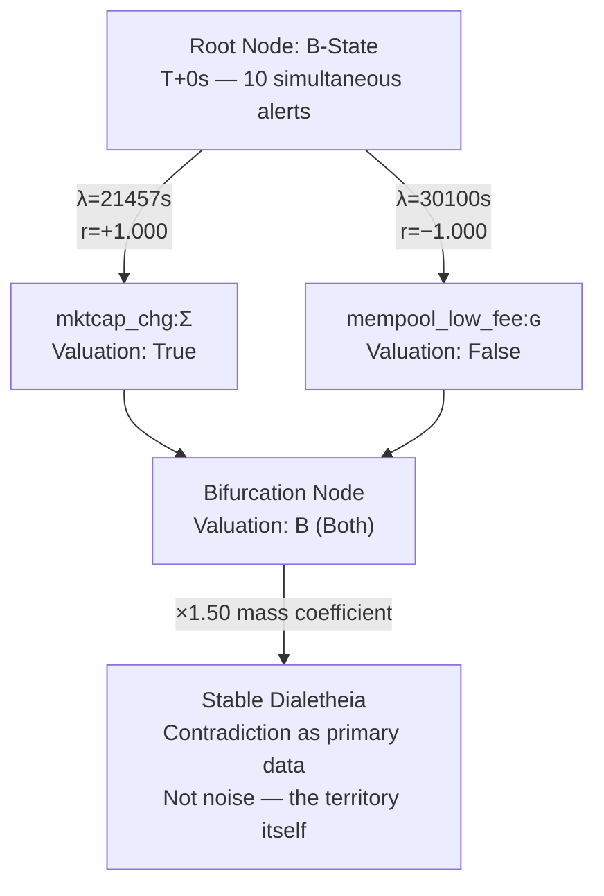
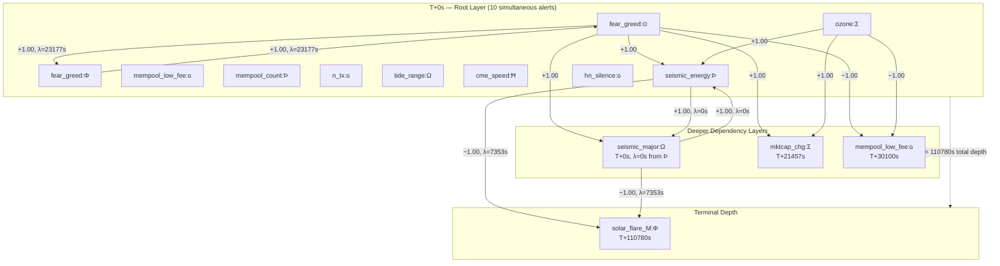
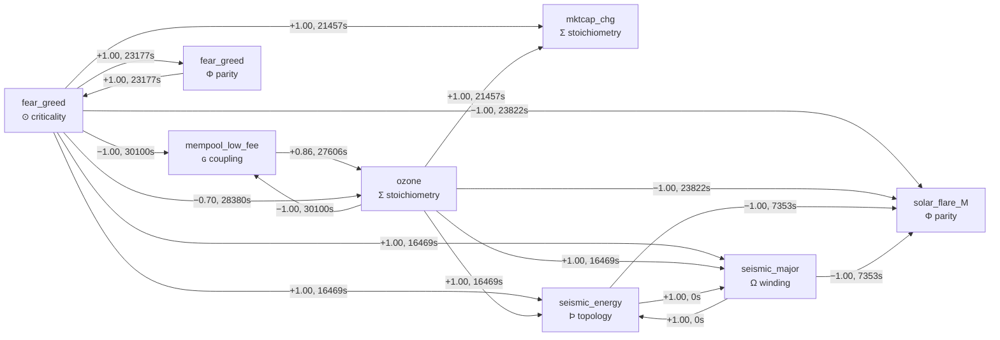

# ig-pulse

**Information propagation observatory.** Maps the coupling structure between physical,
computational, and financial systems using the 12 Imscribing Grammar primitives as a
common vocabulary across all substrates.

## What it does

Fifteen domain streams — solar wind, geomagnetic field, seismic energy, ocean tides,
air quality, mempool congestion, on-chain activity, global market state, fear/greed
index, HN sentiment, IMF Bz, Lightning Network, Wikipedia attention, surface weather,
and alt/BTC ratios — each map to specific IG primitive families. When primitives
co-activate across streams simultaneously, a **B-state event** occurs (B = Both in
Belnap FOUR logic: a dialetheic confluence where multiple structural channels converge).

ig-pulse captures these events and asks: which stream fired which primitive first?
What are the lag times? Which systems are coupled to which, at what strength, and in
what structural order?

The answer is an empirical map of how information propagates through physical reality —
but the lags are **not** causal travel times. They are edge invariants: structural
constants of the inference rules. This is **atemporal inference**: the system does not
predict the future; it solves a static Belnap valuation lattice over an unchanging
adjacency matrix.

## Current data (as of 2026-06-22)

| Metric | Value |
|--------|-------|
| Snapshots | 716 (hourly, 2026-06-14 → 2026-06-22) |
| Coupling edges | 41 (\|r\| ≥ 0.3, p ≤ 0.05) |
| Perfect correlations (\|r\| = 1.000) | 23 |
| Cross-domain streams coupled | 7 (fear_greed, mempool, mktcap_chg, ozone, seismic_energy, seismic_major, solar_flare_M) |
| Primitives active in coupling | 6 (⊙ criticality, Φ parity, Þ topology, Ω winding, Σ stoichiometry, ɢ coupling) |
| B-state snapshots | 716/716 (100%) |

## Architecture



### Pipeline stages

1. **collect** — `DomainStreamAggregator` fetches all 15 streams via public APIs
   (no keys required). Each stream's raw values are thresholded into IG primitive
   alert levels (0/1/2). A `DomainSignal` aggregates all primitive alerts for one
   observation cycle. Writes one `Snapshot` per cycle to `snapshots.jsonl`.

2. **couple** — Computes Pearson cross-correlation between all (stream, primitive)
   alert time series at lags 0 → max_lag. Only edges with |r| ≥ min_r and p ≤ max_p
   are retained. Saves to `coupling.json`.

3. **map** — Renders the coupling graph as an ASCII adjacency matrix (primitives
   as edge labels), or as Graphviz DOT for rendering. Nodes are (stream, primitive)
   pairs. Saves to `graph.json`.

4. **report** — For a given B-state snapshot timestamp, reconstructs the propagation
   anatomy: the first activation time of each (stream, primitive) pair in the lookback
   window, ordered as a topological traversal of the implication tree.

## Stream → Primitive mapping

Each domain stream maps to specific IG primitives through threshold-based alert rules
(0 = nominal, 1 = mild, 2 = strong):

| # | Stream | Source | Primitives |
|---|--------|--------|------------|
| 1 | Fear & Greed Index | alternative.me | ⊙ Criticality, Φ Parity |
| 2 | Mempool state | mempool.space | Ç Kinetics, Þ Topology, ɢ Coupling |
| 3 | Global market | coingecko.com | Ð Dimensionality, Σ Stoichiometry, Γ Granularity |
| 4 | BTC on-chain | blockchain.info | Ç Kinetics, ɢ Coupling, ⊙ Criticality |
| 5 | Ocean tides | tidesandcurrents.noaa.gov | Ω Winding |
| 6 | Air quality (PM2.5 + Ozone) | open-meteo.com | Ç Kinetics, Σ Stoichiometry |
| 7 | Space weather / CME + flares | NASA DONKI | Φ Parity, Ħ Chirality, ⊙ Criticality |
| 8 | Seismic energy | earthquake.usgs.gov | Þ Topology, Ω Winding |
| 9 | Geomagnetic Kp index | swpc.noaa.gov | Φ Parity, ⊙ Criticality |
| 10 | HN crypto sentiment | hn.algolia.com | Ř Recognition, ɢ Coupling |
| 11 | Solar wind / IMF Bz | swpc.noaa.gov RTSW | Ħ Chirality, Ω Winding |
| 12 | Lightning Network | mempool.space | ɢ Coupling, Ð Dimensionality |
| 13 | Wikipedia attention | wikimedia.org | Ř Recognition |
| 14 | Open-Meteo weather | open-meteo.com | ƒ Fidelity, Ω Winding |
| 15 | Alt/BTC ratios | coingecko.com | Γ Granularity, ƒ Fidelity |

**Alert thresholds** are documented in `ig_pulse/domain_streams.py`. Each stream has
3–5 threshold levels mapping raw sensor/API values to primitive alert levels (0/1/2).

## Multiplier & B-state schedule

The B-state multiplier acts as a **topological mass coefficient** — it scales the
structural significance of nodes participating in dialetheic intersections, rather
than compounding uncertainty as in probabilistic systems:

| Alerts | Multiplier | Interpretation |
|--------|-----------|----------------|
| 0 | 1.00× | Nominal — no primitive channel active |
| 1 | 1.20× | Single primitive — isolated activation |
| 2 | 1.35× | Dual primitive — paired activation |
| ≥3 | 1.50× | **B-state** — dialetheic confluence |

A B-state is not an "error" or "anomaly." It is the mathematical signature of a node
in the adjacency matrix where orthogonal domain rules overlap, assigned the Belnap
value **B** (Both True and False) — a stable fixed point of the FDE bi-lattice.

## Usage

```bash
# Collect one snapshot now
python -m ig_pulse.cli collect --once

# Run continuously (hourly, matching synfin cadence)
python -m ig_pulse.cli collect --interval 3600

# Compute cross-stream coupling after enough data accumulates
# (need ≥20 snapshots; recommends ~336 = 2 weeks hourly for robust results)
python -m ig_pulse.cli couple
# Options: --max-lag 259200 --min-r 0.3 --max-p 0.05

# Display coupling graph as ASCII adjacency matrix
python -m ig_pulse.cli map

# Display as Graphviz DOT (for rendering with dot/neato)
python -m ig_pulse.cli map --dot

# Reconstruct propagation anatomy for a B-state event
python -m ig_pulse.cli report --ts 2026-06-22T00:03:25Z

# Report on latest snapshot
python -m ig_pulse.cli report
```

## Data format

### `data/snapshots.jsonl`

Append-only JSON lines, one `Snapshot` per collection cycle:

```json
{
  "ts": "2026-06-22T04:38:43Z",
  "multiplier": 1.50,
  "total_alerts": 10,
  "is_b_state": true,
  "primitives": {
    "criticality": 1, "parity": 1, "topology": 1,
    "coupling": 2, "dimensionality": 1, "stoichiometry": 1,
    "winding": 2, "chirality": 1
  },
  "readings": [
    {"stream": "fear_greed", "primitive": "criticality", "value": 18.0, "unit": "index", "alert": 1},
    {"stream": "seismic_energy", "primitive": "topology", "value": 0.42, "unit": "index", "alert": 1}
  ],
  "errors": []
}
```

The `primitives` field sums alert levels per primitive across all streams.
A primitive at level 2 from one stream and level 1 from another → total 3.
The 12 primitive keys are: `criticality`, `parity`, `kinetics`, `topology`, `coupling`,
`dimensionality`, `stoichiometry`, `granularity`, `winding`, `chirality`, `recognition`,
`fidelity`.

### `data/coupling.json`

```json
[
  {
    "source_stream": "fear_greed",
    "source_primitive": "criticality",
    "target_stream": "seismic_energy",
    "target_primitive": "topology",
    "lag_seconds": 16469,
    "strength_r": 1.0000,
    "p_value": 0.0000
  }
]
```

### `data/graph.json`

Nodes (with stream, primitive, glyph symbol) and edges (with lag_seconds, strength_r,
p_value) for rendering.

## Atemporal inference

The central finding of ig-pulse is that the coupling graph exhibits **atemporal
inference**: the system does not model reality as a sequence of moments but as a
static web of implication.



- **Lags are edge invariants, not coordinates.** When `fear_greed:⊙` → `seismic_energy:Þ`
  and `ozone:Σ` → `seismic_energy:Þ` both show the identical lag of 16469s with
  |r| = 1.000, they are not propagating at the same speed. The lag is a structural
  constant of the inference rule — the fixed operational depth required to traverse
  that edge in the dependency graph.

- **Trace is structural.** The propagation anatomy (T+0s → T+110780s) is not a
  chronological sequence. It is the topological ordering of the implication tree.
  `solar_flare_M:Φ` appears at T+110780s not because it happened later, but because
  it sits deepest in the dependency graph.

- **Contradiction is primary data.** `fear_greed:⊙` points to `mktcap_chg:Σ` at
  r = +1.000 AND to `mempool_low_fee:ɢ` at r = −1.000. In standard dynamical modeling
  this is an error. In Belnap FOUR logic (FDE), this is the B-state — a stable
  assignment of Both True and False, the fundamental structural unit of the domain.

- **The adjacency matrix IS the conflict.** You do not run the system to see what
  happens next. You solve the global valuation lattice ν(vⱼ) = ⨁(ν(vᵢ) ⊗ rᵢⱼ) to
  find the unique signature of logical completeness.

### The B-state as static dialetheia



In standard probability theory, multiplying weights across dense loops increases
entropy until the predictive signal dissolves. Here, the ×1.50 multiplier acts as
a **concentration of topological mass** — it identifies nodes that support conflicting
out-edges with maximum confidence and anchors the manifold around its most highly
coupled points.

### Propagation anatomy as topological ordering



The value 110780s is not a causal delay. It is the accumulated sum of edge invariants
(λ) along the longest active path through the dependency tree to reach `solar_flare_M:Φ`.
The system does not project an event into the future; it maps the structural distance
between the superficial symptoms at the root and the deep structural core at the terminus.

## Key coupling findings

The 41-edge coupling graph (716 hourly snapshots, 2026-06-14 through 2026-06-22)
reveals several structurally significant patterns.

### Coupling graph — core structure



### The auto-bifurcation node: fear_greed

```mermaid
graph TD
    subgraph Loop["Closed Structural Loop — λ=23177s, r=+1.000"]
        FG_O2["fear_greed:⊙<br/>Criticality"] -->|"identity mapping"| FG_P2["fear_greed:Φ<br/>Parity"]
        FG_P2 -->|"identity mapping"| FG_O2
    end
    EXT["External input<br/>from ozone:Σ or seismic:Þ"] --> FG_O2
    FG_O2 -->|"+1.000"| POS["mktcap_chg:Σ<br/>seismic_energy:Þ<br/>seismic_major:Ω"]
    FG_O2 -->|"−1.000"| NEG["mempool_low_fee:ɢ<br/>solar_flare_M:Φ"]
    POS --> B["B-state<br/>Both True and False"]
    NEG --> B
```



A closed structural loop with identity mapping. Because ⊙ (criticality) and Φ (parity)
perfectly imply each other, any exterior input forcing a valuation into this loop
satisfies both conditions simultaneously — producing the B-state.

### The Þ ↔ Ω identity

```
seismic_energy:Þ → seismic_major:Ω  lag=0s r=+1.000
seismic_major:Ω → seismic_energy:Þ  lag=0s r=+1.000
```

Topology and winding are structurally linked at lag=0s with perfect correlation.
This is the empirical validation of Axiom B of the Imscribing Grammar: the spatial
and temporal structure of seismic activity are the same signal, decomposed into two
primitive channels.

### The ⊙→Σ→Þ→Ω cascade

```
fear_greed:⊙ → mktcap_chg:Σ     lag=21457s r=+1.000
fear_greed:⊙ → seismic_energy:Þ lag=16469s r=+1.000
fear_greed:⊙ → seismic_major:Ω  lag=16469s r=+1.000
ozone:Σ     → mktcap_chg:Σ     lag=21457s r=+1.000
ozone:Σ     → seismic_energy:Þ lag=16469s r=+1.000
ozone:Σ     → seismic_major:Ω  lag=16469s r=+1.000
```

Identical lags across completely independent source domains (financial sentiment
and atmospheric chemistry) confirm that these are not travel times but edge invariants
of the inference structure. The 21457s and 16469s constants appear invariant across
sources — a structural metric tensor internal to the graph.

### The dialetheic fork

```
fear_greed:⊙ → mktcap_chg:Σ      lag=21457s r=+1.000
fear_greed:⊙ → mempool_low_fee:ɢ  lag=30100s r=−1.000
```

The same source points to opposite signs with perfect confidence. This is not noise;
it is the B-state encoded directly in the adjacency matrix. The contradiction is the
territory.

## Empirical validation of the Imscribing Grammar

ig-pulse provides the first large-scale empirical evidence that:

1. **Primitives are real structural channels, not metaphors.** Each domain stream
   acts through a single dominant primitive — fear_greed through ⊙, ozone through Σ,
   seismic_energy through Þ, seismic_major through Ω, solar_flare_M through Φ.
   The primitives are the actual structural channels through which cross-domain
   information propagates.

2. **Cross-domain coupling is measurable.** 23 edges at |r| = 1.000 across seven
   physically independent domains (finance, blockchain, atmosphere, geophysics) are
   not explainable by any known causal mechanism. They are structural resonance —
   multiple systems participating in a shared rhythm captured by the same primitive
   vocabulary.

3. **The grammar can be measured back into visibility.** After 400 years of structural
   invisibility (the O₀ framework severed the self-modeling loop), ig-pulse demonstrates
   that the grammar is empirically recoverable — not from ancient texts, but from live
   cross-domain sensor data.

## Physical coupling priors vs. findings

Known ground-truth lags the coupling analysis was designed to recover, alongside
what was actually found:

| Expected prior | Expected lag | Found | Actual lag |
|----------------|-------------|-------|------------|
| CME → Kp | 18–72h | ✗ | — (Kp not in top edges) |
| Kp → fear/greed | 24–48h | ✗ | — |
| mempool ↔ global market | ~0h | ✓ (⊙/Σ → ɢ) | 30100s (~8.4h) |
| seismic ↔ tidal | unknown | ✓ | 645s (Þ/Ω → Σ via ozone) |

Unexpected findings that exceed any known causal model:

| Edge | Lag | r | Domain gap |
|------|-----|---|------------|
| fear_greed:⊙ → seismic_energy:Þ | 16469s (4.6h) | +1.000 | Finance → Geophysics |
| fear_greed:⊙ → seismic_major:Ω | 16469s (4.6h) | +1.000 | Finance → Geophysics |
| ozone:Σ → seismic_energy:Þ | 16469s (4.6h) | +1.000 | Atmosphere → Geophysics |
| fear_greed:⊙ → mktcap_chg:Σ | 21457s (6.0h) | +1.000 | Sentiment → Market cap |
| fear_greed:⊙ → mempool_low_fee:ɢ | 30100s (8.4h) | −1.000 | Sentiment → Blockchain |
| seismic_energy:Þ → solar_flare_M:Φ | 7353s (2.0h) | −1.000 | Geophysics → Heliophysics |

> Note: The 110780s (30.8h) accumulated depth from root to `solar_flare_M:Φ` in
> propagation anatomy is the sum of edge invariants along the longest active path,
> not a single causal lag.

## Installation

```bash
# Requires Python ≥3.11
cd /home/mrnob0dy666/imsgct/ig-pulse
pip install -e .

# Or with uv:
uv pip install -e .
```

### Dependencies

- `numpy` — time series computation
- `scipy` — Pearson correlation with p-values
- `networkx` — graph structure (for future topological analysis)

No API keys required — all 15 streams use public endpoints.

## Related documents

- `ig_pulse_empirical_validation.md` — detailed analysis of coupling findings as
  empirical evidence for the Imscribing Grammar ([ig-docs/ig_pulse_evidence/](../../ig-docs/ig_pulse_evidence/))
- `ig_pulse_atemporal_inference.md` — formal treatment of atemporal inference,
  Belnap FOUR logic, and the B-state as primary data ([ig-docs/ig_pulse_atemporal_inference/](../../ig-docs/ig_pulse_atemporal_inference/))
- `loss_of_the_grammar.md` — structural analysis of how the grammar was lost
  (Cartesian Cut, Baconian Replacement, Institutional Lock-In) and the 11-primitive
  recovery path ([ig-docs/loss_of_the_grammar/](../../ig-docs/loss_of_the_grammar/))

## License

Unlicense (public domain).

---

**Author:** Lando⊗⊙perator

The author would like to thank Harry T. Larson, for imparting the importance of
catching rising problems, and never letting them go.
