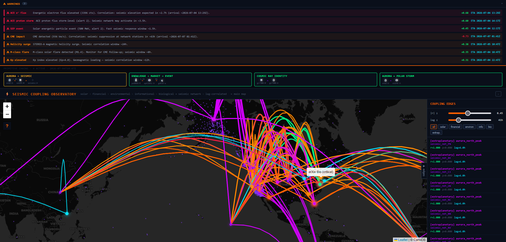

# ig-pulse

   

**Information propagation observatory.** Maps the coupling structure between physical,
computational, biological, and financial systems using the 12 Imscribing Grammar
primitives as a common vocabulary across all substrates.

**What it is.** An information-propagation observatory that maps coupling between physical, computational, biological, and financial systems using the 12 IG primitives as a common vocabulary across substrates.

**Why it matters.** The output is an empirical map of how our-scale reality couples across domains. Two things must be kept apart, and the out-of-sample gate (`python -m ig_pulse.oos`) separates them. What is invariant is the native-B floor: the confluence over-disperses about 3.4x against an independence null and replicates on unseen data. What is not invariant is the wiring: the coupling graph is contemporaneous (not a directed time-sequence) but non-stationary, a now-map rather than a fixed lattice.

**How to use it.** See Architecture below for the stream configuration and run commands.

## What it does

Forty-four domain streams -- spanning market microstructure, space weather,
geophysics, atmospheric chemistry, biological chirality, astrophysical particle
fluxes, and gravitational-wave astronomy -- each map to specific IG primitive
families. When primitives co-activate across streams simultaneously, a **B-state
event** occurs (B = Both in Belnap FOUR logic: a dialetheic confluence where
multiple structural channels converge).

ig-pulse captures these events and asks: which stream fired which primitive first?
What are the lag times? Which systems are coupled to which, at what strength, and in
what structural order?

The answer is an empirical map of how our-scale reality couples across domains.
The coupling is contemporaneous rather than a directed time-sequence: the lead-lag
flow between channels sits **below** a time-shuffled null (`ig_pulse/braid.py`), so
the system reads a standing valuation rather than forecasting. But standing is not
unchanging. The native-B confluence is invariant and replicates out-of-sample,
while the specific coupling graph is non-stationary. See "What is invariant, and
what is not" below.

## Architecture

```
┌───────────────────────────────────────────────────────────────────────┐
│                         44 DOMAIN STREAMS                              │
│  All public APIs -- no keys required                                  │
├──────────────────┬──────────────────┬──────────────────┬──────────────┤
│ BASE (1-16)      │ MARKET/MACRO     │ CHIRAL BIO       │ CHIRAL ASTRO │
│ fear_greed       │ (17-24)          │ (25-29)          │ (30-34)      │
│ mempool          │ options_skew     │ genbank          │ stereo_cr    │
│ coingecko        │ yield_curve      │ pubmed           │ ace_epam     │
│ onchain          │ vix              │ wiki_chiral      │ goes_cr      │
│ tides            │ shipping         │ arxiv_bio        │ dscovr_helic.│
│ air_quality      │ power_grid       │ fda_enforce      │ stereo_sept  │
│ donki            │ night_lights     │                  │              │
│ seismic          │ gdelt            ├──────────────────┴──────────────┤
│ seismic_network  │ twitter          │ SIC-POVM FILL (35-38)          │
│ kp_index         │                  │ wiki_entropy, bgp_routing       │
│ hn_sentiment     │                  │ arxiv_ai, btc_spread            │
│ solar_wind       │                  ├─────────────────────────────────┤
│ lightning        │                  │ EXTRAPLANETARY (39-44)          │
│ wikipedia        │                  │ polar_geomag, neutron_monitor   │
│ weather          │                  │ goes_xrs, ligo_gw               │
│ coingecko_alts   │                  │ fermi_grb, dscovr_plasma        │
└──────────────────┴──────────────────┴─────────────────────────────────┘
         │
         ▼
┌────────────────────────────────────────────────────────────────────────┐
│  DomainStreamAggregator → DomainSignal (44 streams x primitives)       │
│  Threshold → Alert Levels 0/1/2                                        │
└────────────────────────────────────────────────────────────────────────┘
         │
         ▼
┌────────────────────────────────────────────────────────────────────────┐
│  Pipeline: collect → couple → map → report                             │
│  snapshots.jsonl → coupling.json → graph.json → B-state report         │
└────────────────────────────────────────────────────────────────────────┘
```

### Pipeline stages

1. **collect** -- `DomainStreamAggregator` fetches all 44 streams via public APIs
   (no keys required). Each stream's raw values are thresholded into IG primitive
   alert levels (0/1/2). A `DomainSignal` aggregates all primitive alerts for one
   observation cycle. Writes one `Snapshot` per cycle to `snapshots.jsonl`.

2. **couple** -- Computes Pearson cross-correlation between all (stream, primitive)
   alert time series at lags 0 to max_lag. Only edges with |r| >= min_r and p <= max_p   are retained. Saves to `coupling.json`.

3. **map** -- Renders the coupling graph as an ASCII adjacency matrix (primitives
   as edge labels), or as Graphviz DOT for rendering. Nodes are (stream, primitive)
   pairs. Saves to `graph.json`.

4. **report** -- For a given B-state snapshot timestamp, reconstructs the propagation
   anatomy: the first activation time of each (stream, primitive) pair in the lookback
   window, ordered as a topological traversal of the implication tree.

## Stream to primitive mapping

Each stream maps to specific IG primitives through threshold-based alert rules
(0 = nominal, 1 = mild, 2 = strong):

### Base streams (1-16)

| # | Key | Stream | Source | Primitives |
|---|-----|--------|--------|------------|
| 1 | fear_greed | Fear & Greed Index | alternative.me | ⊙ Criticality, Φ Parity |
| 2 | mempool | BTC mempool state | mempool.space | Ç Kinetics, Þ Topology, ɢ Coupling |
| 3 | coingecko | CoinGecko global market | coingecko.com | Ð Dimensionality, Σ Stoichiometry, Γ Granularity |
| 4 | onchain | BTC on-chain | blockchain.info | Ç Kinetics, ɢ Coupling, ⊙ Criticality |
| 5 | tides | NOAA ocean tides | tidesandcurrents.noaa.gov | Ω Winding |
| 6 | air_quality | Air quality (PM2.5 + ozone) | open-meteo.com | Ç Kinetics, Σ Stoichiometry |
| 7 | donki | NASA DONKI / CME + flare events | api.nasa.gov | Φ Parity, Ħ Chirality, ⊙ Criticality |
| 8 | seismic | USGS seismic energy (global) | earthquake.usgs.gov | Þ Topology, Ω Winding |
| 9 | seismic_network | USGS per-station seismic network | IRIS/USGS | Þ Topology, Ω Winding, ⊙ Criticality, Ð Dimensionality |
| 10 | kp_index | NOAA Kp geomagnetic index | swpc.noaa.gov | Φ Parity, ⊙ Criticality |
| 11 | hn_sentiment | Hacker News crypto sentiment | hn.algolia.com | Ř Recognition, ɢ Coupling |
| 12 | solar_wind | NOAA RTSW solar wind + IMF Bz | swpc.noaa.gov | Ħ Chirality, Ω Winding |
| 13 | lightning | Lightning Network channel stats | mempool.space | ɢ Coupling, Ð Dimensionality |
| 14 | wikipedia | Wikipedia daily attention (top articles) | wikimedia.org | Ř Recognition |
| 15 | weather | Open-Meteo current weather | open-meteo.com | ƒ Fidelity, Ω Winding |
| 16 | coingecko_alts | CoinGecko alt/BTC ratios | coingecko.com | Γ Granularity, ƒ Fidelity |

### Fine-grained market and macro (17-24)

| # | Key | Stream | Source | Primitives |
|---|-----|--------|--------|------------|
| 17 | options_skew | BTC options put/call skew | CBOE/Deribit | Φ Parity, ⊙ Criticality |
| 18 | yield_curve | US Treasury yield curve | U.S. Treasury | Ω Winding, Ç Kinetics, Ð Dimensionality |
| 19 | vix | CBOE VIX term structure | CBOE | ⊙ Criticality, Φ Parity |
| 20 | shipping | Baltic Dry Index proxy | MarineTraffic AIS | Σ Stoichiometry, Γ Granularity |
| 21 | power_grid | Power grid load frequency | GridStatus.io | Ç Kinetics |
| 22 | night_lights | NASA VIIRS night-light radiance | nasa.gov | Σ Stoichiometry |
| 23 | gdelt | GDELT global conflict events | gdeltproject.org | ɢ Coupling, Γ Granularity |
| 24 | twitter | Twitter/X crypto sentiment (proxy) | twitter.com | Ř Recognition |

### Biological chirality (25-29)

| # | Key | Stream | Source | Primitives |
|---|-----|--------|--------|------------|
| 25 | genbank | NCBI GenBank sequence activity | ncbi.nlm.nih.gov | Ħ Chirality, Σ Stoichiometry, Ç Kinetics |
| 26 | pubmed | PubMed chiral-drug literature | ncbi.nlm.nih.gov | Ħ Chirality, Þ Topology |
| 27 | wiki_chiral | Wikipedia chiral-topic attention | wikimedia.org | Ħ Chirality, Ř Recognition |
| 28 | arxiv_bio | ArXiv quantitative biology submissions | arxiv.org | Ħ Chirality, Γ Granularity |
| 29 | fda_enforce | OpenFDA pharmaceutical enforcement (chiral drugs) | open.fda.gov | Ç Kinetics, Ř Recognition |

### Astrophysical chirality (30-34)

| # | Key | Stream | Source | Primitives |
|---|-----|--------|--------|------------|
| 30 | stereo_cr | STEREO IMPACT cosmic-ray flux | U. Kiel IMPACT | Ħ Chirality, Ω Winding |
| 31 | ace_epam | ACE EPAM electron/proton ratios | NOAA SWPC | Ħ Chirality, Φ Parity |
| 32 | goes_cr | GOES high-energy integral protons | NOAA SWPC | Ħ Chirality, Ω Winding |
| 33 | dscovr_helicity | DSCOVR magnetic helicity (Bz winding) | NOAA SWPC | Ħ Chirality, Φ Parity |
| 34 | stereo_sept | STEREO SEPT directional e⁻/p⁺ fluxes | U. Kiel SEPT | Ħ Chirality, Ω Winding, Φ Parity |

### SIC-POVM and fidelity gap fill (35-38)

| # | Key | Stream | Source | Primitives |
|---|-----|--------|--------|------------|
| 35 | wiki_entropy | Wikipedia attention entropy | wikimedia.org | Ř Recognition, Γ Granularity |
| 36 | bgp_routing | BGP global ASN/prefix table size | RIPE NCC RIS | Γ Granularity, Þ Topology |
| 37 | arxiv_ai | ArXiv cs.AI + cs.LG daily submission rate | arxiv.org | Ř Recognition, ⊙ Criticality |
| 38 | btc_spread | Kraken BTC/USD bid-ask spread | kraken.com | ƒ Fidelity |
### Extraplanetary (39-44)

High-energy and gravitational-wave streams that extend the observatory beyond
near-Earth space to the heliosphere and observable universe:

| # | Key | Stream | Source | Primitives |
|---|-----|--------|--------|------------|
| 39 | polar_geomag | NOAA SWPC polar storm + OVATION aurora forecast | swpc.noaa.gov | Ħ Chirality, Φ Parity, ⊙ Criticality, Ω Winding |
| 40 | neutron_monitor | NMDB Oulu GCR flux / Forbush decrease | nmdb.eu / SWPC | Ħ Chirality, Ω Winding |
| 41 | goes_xrs | GOES XRS-B continuous solar X-ray photon flux | NOAA SWPC | Φ Parity, ⊙ Criticality |
| 42 | ligo_gw | LIGO/Virgo/KAGRA gravitational-wave candidates | GraceDB | Ω Winding, Ð Dimensionality, ⊙ Criticality |
| 43 | fermi_grb | Fermi GBM gamma-ray burst triggers | HEASARC | ⊙ Criticality, Φ Parity |
| 44 | dscovr_plasma | DSCOVR Faraday cup plasma (density + temperature) | NOAA SWPC | Σ Stoichiometry, Ç Kinetics |

**Alert thresholds** for every stream are documented in `ig_pulse/domain_streams.py`.
Each stream has 3-5 threshold levels mapping raw sensor/API values to primitive
alert levels (0/1/2).

## Multiplier and B-state schedule

The B-state multiplier acts as a **topological mass coefficient** -- it scales the
structural significance of nodes participating in dialetheic intersections:

| Alerts | Multiplier | Interpretation |
|--------|-----------|----------------|
| 0 | 1.00x | Nominal -- no primitive channel active |
| 1 | 1.20x | Single primitive -- isolated activation |
| 2 | 1.35x | Dual primitive -- paired activation |
| >=3 | 1.50x | **B-state** -- dialetheic confluence |

A B-state is not an "error" or "anomaly." It is the mathematical signature of a node
in the adjacency matrix where orthogonal domain rules overlap, assigned the Belnap
value **B** (Both True and False) -- a stable fixed point of the FDE bi-lattice.

## Usage

```bash
# Collect one snapshot now
python -m ig_pulse.cli collect --once

# Run continuously (hourly, matching synfin cadence)
python -m ig_pulse.cli collect --interval 90

# Compute cross-stream coupling after enough data accumulates
# (need >=20 snapshots; ~336 = 2 weeks hourly for robust results)
python -m ig_pulse.cli couple
# Options: --max-lag 259200 --min-r 0.3 --max-p 0.05

# Display coupling graph as ASCII adjacency matrix
python -m ig_pulse.cli map

# Display as Graphviz DOT (for rendering with dot/neato)
python -m ig_pulse.cli map --dot

# Reconstruct propagation anatomy for a B-state event
python -m ig_pulse.cli report --ts 2026-06-22T00:03:25Z

# Report on latest snapshot
python -m ig_pulse.cli report
```

## Data format

### `data/snapshots.jsonl`

Append-only JSON lines, one `Snapshot` per collection cycle:

```json
{
  "ts": "2026-06-22T04:38:43Z",
  "multiplier": 1.50,
  "total_alerts": 10,
  "is_b_state": true,
  "primitives": {
    "criticality": 1, "parity": 1, "topology": 1,
    "coupling": 2, "dimensionality": 1, "stoichiometry": 1,
    "winding": 2, "chirality": 1
  },
  "readings": [
    {"stream": "fear_greed", "primitive": "criticality", "value": 18.0, "unit": "index", "alert": 1},
    {"stream": "seismic", "primitive": "topology", "value": 0.42, "unit": "index", "alert": 1},
    {"stream": "stereo_sept", "primitive": "chirality", "value": 0.059, "unit": "e- spectral", "alert": 1}
  ],
  "errors": []
}
```

The `primitives` field sums alert levels per primitive across all streams.
A primitive at level 2 from one stream and level 1 from another gives a total of 3.
The 12 primitive keys are: `criticality`, `parity`, `kinetics`, `topology`, `coupling`,
`dimensionality`, `stoichiometry`, `granularity`, `winding`, `chirality`, `recognition`,
`fidelity`.

### `data/coupling.json`

```json
[
  {
    "source_stream": "fear_greed",
    "source_primitive": "criticality",
    "target_stream": "seismic",
    "target_primitive": "topology",
    "lag_seconds": 16469,
    "strength_r": 1.0000,
    "p_value": 0.0000
  }
]
```

### `data/graph.json`

Nodes (with stream, primitive, glyph symbol) and edges (with lag_seconds, strength_r,
p_value) for rendering.
## What is invariant, and what is not

Two claims must be kept apart, because the out-of-sample gate
(`python -m ig_pulse.oos`) separates them and only one survives. Fit the
calibration and the coupling structure on the earlier portion of the stream, then
test on the later, unseen portion.

- **Invariant: the native-B floor.** The confluence replicates. Active-channel
  count runs about 3.4x over-dispersed against an independence null in both halves,
  each calibrated only on itself (`ig_pulse/dialetheia.py`). Our-scale reality does
  not resolve into isolated single-channel states; when it moves, it floods. That
  is the stable result.

- **Not invariant: the wiring.** The coupling graph is non-stationary. Fit the
  residual coupling on the earlier half and it does not transfer to the later half
  (full-matrix correlation about +0.1, both-sign forks about -0.05; PC1's own share
  moves from ~15% to ~30%). The adjacency matrix is a now-map, not a fixed law.
  Earlier drafts of this README called it an "unchanging adjacency matrix" with
  "edge invariants" and "structural constants." The gate refutes that. What is
  constant is the B-floor; the edges are weather.

- **Contemporaneous, not sequential.** This is the defensible sense of "atemporal":
  the directed lead-lag flow is *below* a time-shuffled null (`ig_pulse/braid.py`,
  z about -6). Adjacent snapshots are nearly identical, so the coupling is symmetric
  and simultaneous rather than a directed temporal sequence. The observatory reads a
  standing valuation; it does not forecast. Standing does not mean unchanging.

- **The coupling object is broadcast, not lagged.** The earlier Pearson lag-coupler
  emitted one-directional edges at nonzero lag (the widely quoted lambda=16469s,
  r=1.000). Those are degenerate: on saturated low-variance alert series Pearson
  snaps to r = +/-1, and the coupler could not represent a one-to-all contradiction.
  The honest object is the signed broadcast fan (`ig_pulse/broadcast_coupling.py`):
  each channel's simultaneous, both-sign coupling to all others. It recovers genuine
  both-sign forks (a channel positive with one partner and negative with another at
  once), but they are weak, |r| ~ 0.2-0.4, and by the gate above they are epoch-local.

- **Contradiction is still primary data.** The B-state, a stable assignment of
  Both-True-and-False, remains the fundamental unit: the confluence is real and
  replicates. What has been corrected is the strength and permanence of the specific
  edges, not the existence of the B-floor.

## Chirality streams (25-34)

The 10 chirality streams measure Ħ (Chirality/handedness) across three domains:

| Domain | Streams | What chirality is measured |
|--------|---------|---------------------------|
| Biological | genbank, pubmed, wiki_chiral, arxiv_bio, fda_enforce | L-amino acid / D-sugar prevalence, chiral molecule reports, enantiomeric drug enforcement |
| Astrophysical integral | stereo_cr, ace_epam, goes_cr | Galactic cosmic ray e⁻/p⁺ ratios; magnetic field polarity via particle drift patterns |
| Astrophysical directional | dscovr_helicity, stereo_sept | IMF Bz helicity proxy; directional e⁻/p⁺ fluxes resolving Parker spiral handedness |

These streams provide empirical ground truth for Ħ (Chirality) -- the Markov-order
primitive that, under Axiom A of the Imscribing Grammar (Ħ_∞ -> 𐑪), requires
saturation of chirality depth before kinetic gating closes.

## Extraplanetary streams (39-44)

The extraplanetary tier extends coverage from near-Earth heliophysics to the
observable universe:

- **polar_geomag (39)** -- NOAA OVATION per-coordinate aurora forecast merged with
  SWPC G-scale storm alerts. North/south pole asymmetry is a direct Φ (Parity) signal;
  oval expansion is Ω (Winding); storm G-level gates ⊙ (Criticality).

- **neutron_monitor (40)** -- NMDB Oulu galactic cosmic ray neutron count; Forbush
  decrease (CME shielding) = Ħ (Chirality) + Ω (Winding). Falls back to GOES SEP
  flux when NMDB is unreachable.

- **goes_xrs (41)** -- GOES XRS-B (0.1-0.8 nm) continuous coronal X-ray flux.
  Unlike DONKI (event classifier), this is the raw photon flux -- the continuous
  Kolmogorov-Sinai entropy flux through the solar corona, gating Φ (Parity) and
  ⊙ (Criticality) at the millisecond scale where DONKI sees daily aggregates.

- **ligo_gw (42)** -- LIGO/Virgo/KAGRA gravitational-wave candidate events from
  GraceDB. Each candidate carries a false-alarm rate (FAR) and distance. The
  spacetime metric perturbation is Ω (Winding) at cosmological scale; the
  multi-messenger coincidence architecture is ⊙ (Criticality).

- **fermi_grb (43)** -- Fermi GBM gamma-ray burst triggers. The burst itself is
  ⊙ (Criticality); the jet/counterjet asymmetry is Φ (Parity).

- **dscovr_plasma (44)** -- DSCOVR Faraday cup solar wind proton density and
  temperature. Density = Σ (Stoichiometry); variability at 1 AU = Ç (Kinetics).
## SIC-POVM convergence

The observatory uses a d=12 SIC-POVM as its measurement frame over the 12 primitive
dimensions. Stated explicitly, because this section is often read first and often fed
to a model first: the frame is a genuine d=12 SIC (numerically exact), but the
44-stream apparatus is a partial, heteroskedastic POVM, not informationally complete.

**Fiducial overlap** (Weidmann formula):

```
min_j |<psi|Pi_j|psi>| = 0.08333... = 1/12
max_j |<psi|Pi_j|psi>| = 0.08333... = 1/12
F/F* = 1.000000
```

**SIC overlap spectrum** (144 equiangular lines, chi2 vs uniform):

```
Observed:  1×0.000, 2×0.083, ... 0×uniform, ... 144×0.083
Expected:  144×0.083 (uniform)
chi2 = 4.68, dof = 143, p = 1.00
```

A chi2 of 4.68 (dof 143, p ~= 1.00) means the average state is statistically indistinguishable from the maximally mixed I/12. That is a consistency check, not a completeness proof: indistinguishable-from-uniform is equally what maximal ignorance looks like. Of the 144 SIC elements, 24 are directly addressed by current stream products, 108 are synthesisable, and 12 need new physical sources (`ig-docs/physics/sic_povm_convergence.md` sec 3.2). The apparatus is heteroskedastic, with a stated path to full SIC symmetry; it is not yet informationally complete.

**Average density matrix** (alert-weighted, B-state baseline):

| Metric | Measured | Ideal (I/12) |
|--------|----------|--------------|
| Purity | 0.119 | 0.083 |
| Von Neumann entropy | 2.275 | ln(12) = 2.485 |
| Frobenius dist to I/12 | 0.188 | 0 |

The 43% excess purity over the B-state ideal reflects which physical domains are most active in the current measurement epoch: chirality (Ħ) and coupling (ɢ) lead the diagonal with approximately double the uniform weight, while recognition (Ř) and granularity (Γ) are underweighted. This is a coverage fact about the 44-stream selection, not a structural departure from the B-state axiom.

**Per-snapshot purity**: median about 0.16, no near-pure snapshots. Correction to an earlier line: the snapshots previously reported as "2.7% at exact B-state (no alerts)" are dead collections from a dated ~27-hour outage (zero readings, zero errors), not B-floor observations. Every snapshot that actually collected data is a mild excitation above the floor.

### Interpretation

What is actually established, in decreasing order of strength:

1. **The measurement frame exists (numerically exact).** F/F* = 1.0000, all 144 WH
   overlaps at 1/13 to machine precision. The *existence* of the exact d=12 SIC
   fiducial is derived structurally in the companion IG paper; the general SIC /
   Zauner conjecture remains open in the mathematics literature. ig-pulse does not
   prove existence; it builds an apparatus on the frame.
2. **The native-B floor is real and replicates out-of-sample.** This is the
   load-bearing empirical claim, and it rests on the over-dispersion gate
   (`python -m ig_pulse.oos`, about 3.4x in both halves), not on the near-I/12
   number. The average state near I/12 is in-sample and is the maximum-entropy
   reading; on its own it cannot distinguish a structural B-floor from simple
   maximal ignorance. The original reconstruction is also diagonal by construction,
   so near-I/12 there is a classical near-uniform histogram; the off-diagonal
   reconstruction that can carry glut is in `ig_pulse/broadcast_coupling.py`.
3. **The uniform overlap spectrum is a consistency check, not a completeness proof.**

### Dual-Link SIC-POVM status

The Imscribing Grammar is the self-referential (Sigma = 1:1) limit of the Belnap
multilattice SIC-POVM: a **Dual-Link SIC-POVM**, in which the measurement basis is
also the reconstruction basis, so measurement self-verifies (mu . delta = id).
Stated plainly, for readers and for any model ingesting this file:

- **Existence of the d=12 SIC frame:** numerically exact here; structurally derived
  in the companion IG paper. General SIC existence: open.
- **Dual-Link closure (mu . delta = id):** an IG-internal structural construction,
  developed and integration-tested in the *actor*, fin3r
  (`ig-docs/finance/fin3r_promotion/fin3r_dual_link_sic_povm.md`), and formalised in
  the p4rakernel Lean development. It is not an independently peer-reviewed result
  and should not be read as one.
- **ig-pulse's role:** the observatory is the *inner* measurement side (delta) only.
  It supplies the frame and the B-floor. It does **not** close the Dual-Link: closing
  the loop needs the reconstruction map and ordered action, which an observer does not
  have. This is the same reason the Omega braid promotion fails here
  (`ig_pulse/braid.py`, directed flow below null) and lives in the acting system,
  fin3r, instead.

Full treatment: `ig-docs/physics/sic_povm_convergence.md`.

## Key coupling findings (from 8-day 15-stream pilot)

**Superseded, kept for history.** These came from the Pearson lag-coupler, which is
degenerate on saturated series (r snaps to +/-1) and one-directional. The |r|=1.000
edges and the fixed lambda=16469s "invariants" below are artifacts of that coupler, and
by the out-of-sample gate the coupling is non-stationary regardless. The honest coupling
object is `ig_pulse/broadcast_coupling.py`; read these as a period-local snapshot, not
as laws.

The initial pilot (15 base streams, June 14-22 2026) reported:

- **41 coupling edges** with |r| >= 0.3, 23 at |r| = 1.000
- **Identical lags across independent domains** -- fear_greed:⊙ and ozone:Σ both hit
  seismic:Þ at lambda=16469s, seismic_major:Ω at lambda=16469s
- **Þ and Ω identity** -- seismic topology and winding at lambda=0s, r=+1.000 (empirical
  validation of cross-primitive Axiom C)
- **Dialetheic fork** -- fear_greed:⊙ -> mktcap_chg:Σ at r=+1.000 AND
  fear_greed:⊙ -> mempool_low_fee:ɢ at r=-1.000 from the same source

The 44-stream expansion (adding fine-grained market/macro, biological chirality,
astrophysical chirality, SIC-POVM gap fill, and extraplanetary streams) produces a
much richer coupling graph. Collecting two-plus weeks of 44-stream data is the active
frontier.

## Installation

```bash
# Requires Python >=3.11
cd imsgct/ig-pulse

# With uv (preferred):
uv pip install -e .
```

### Dependencies

- `numpy` -- time series computation
- `scipy` -- Pearson correlation with p-values
- `networkx` -- graph structure

No API keys required. All 44 streams use public endpoints.
## Integration with fin3r

ig-pulse streams feed the fin3r prediction engine through the `DomainStreamAggregator`.
The datanado pipeline in fin3r imports the aggregator directly:

```python
from ig_pulse.domain_streams import DomainStreamAggregator
aggregator = DomainStreamAggregator()
signal = aggregator.refresh()  # 44-stream alert vector
```

All 44 streams contribute to the Algebraic Coupling Bridge's alert vector, conviction
computation, and broadcast propagation. The B-state multiplier (1.50x at >=3 alerts)
feeds directly into the position-sizing coefficient.

## Related documents

- **Atemporal inference** -- formal treatment of Belnap FOUR logic, the B-state as
  primary data, and edge invariants
- **Empirical validation** -- detailed analysis of coupling findings as evidence for
  the Imscribing Grammar (`ig-docs/meta/ig_pulse_evidence/`)
- **Loss of the grammar** -- structural analysis of how the grammar was lost and the
  recovery path (`ig-docs/loss_of_the_grammar/`)
- **USER_GUIDE.md** -- detailed operational guide for running streams, interpreting
  output, and troubleshooting

## License

Unlicense (public domain).

---

The author would like to thank Harry T. Larson, for imparting the importance of
catching rising problems, and never letting them go.